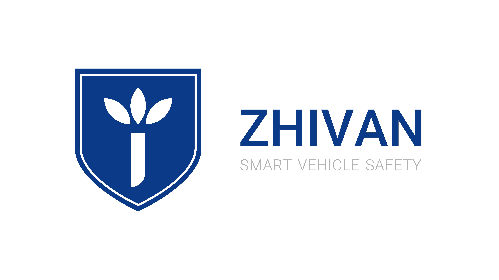

# Zhivan Intelligent System

🌐 [Visit our website](https://zhivan.ai/)

**Enhancing Vehicle Safety & Preventing Road Accidents**

Zhivan Intelligent System Company is dedicated to reducing road traffic accidents, increasing vehicle safety, and improving the driving culture in Iran. Our mission is centered on leveraging advanced technologies to save lives and promote smarter driving.

---

## 🚗 Our Mission

At Zhivan, we aim to:

- Improve road safety and reduce accident rates
- Enhance the safety level of vehicles through smart technologies
- Help elevate Iran’s global standing in traffic safety
- Preserve human lives through proactive safety solutions

We combine cutting-edge global knowledge with local expertise to produce intelligent systems that can be integrated into a wide range of vehicles.

---

## ⚙️ Product Compatibility

Our electronic safety systems are designed for:

- Passenger vehicles  
- Buses  
- Light and heavy-duty trucks  
- Motorcycles

---

## 🤝 Join the Movement

By equipping your vehicles with Zhivan’s innovative safety technologies, you are actively preventing tragic road incidents and creating safer streets for everyone.

---

📍 **Learn more at**: [zhivan.ai](https://zhivan.ai/)
